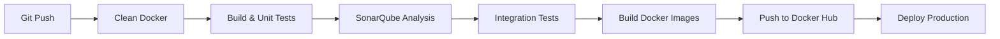

# 🚀 Mr-Jenk - Microservices E-Commerce Platform

<div align="center">


**Une plateforme e-commerce moderne basée sur une architecture microservices avec pipeline CI/CD complet**

[Architecture](#-architecture) • [Technologies](#-stack-technologique) • [Pipeline CI/CD](#-pipeline-cicd) • [Démarrage Rapide](#-démarrage-rapide)

</div>

---

## 📋 À propos du projet

**Mr-Jenk** est un projet d'apprentissage DevOps démontrant la maîtrise complète d'un pipeline CI/CD avec Jenkins. Il implémente une application e-commerce distribuée en microservices, du build automatisé jusqu'au déploiement continu.

### 🎯 Objectifs

- ✅ **Maîtriser Jenkins** : Configuration complète d'un pipeline déclaratif
- ✅ **Automatisation Build → Deploy** : Pipeline complet de bout en bout
- ✅ **Tests Multi-niveaux** : Tests unitaires, d'intégration et analyse de qualité
- ✅ **Containerisation** : Architecture Docker multi-services
- ✅ **Monitoring Qualité** : Intégration SonarQube pour l'analyse de code

---

## 🏗️ Architecture

### Microservices Backend (Java/Spring Boot)

```
┌─────────────────────────────────────────────────────────────┐
│                      API Gateway (8080)                      │
│                   Spring Cloud Gateway                       │
└────────────────────┬────────────────────────────────────────┘
                     │
        ┌────────────┼────────────┬────────────┐
        │            │            │            │
   ┌────▼───┐   ┌───▼────┐  ┌───▼────┐  ┌────▼─────┐
   │ User   │   │Product │  │ Media  │  │Discovery │
   │Service │   │Service │  │Service │  │ Server   │
   │ (8081) │   │ (8082) │  │ (8083) │  │  (8761)  │
   └────────┘   └────────┘  └────────┘  └──────────┘
                                              │
                                         ┌────▼────┐
                                         │ Config  │
                                         │ Service │
                                         │ (8888)  │
                                         └─────────┘
```

### Frontend (Angular/TypeScript)

- **Interface moderne** : Application Angular avec TypeScript
- **Communication sécurisée** : HTTPS avec certificats SSL
- **Proxy Nginx** : Reverse proxy pour optimisation et sécurité

---

## 🛠️ Stack Technologique

### Backend & Infrastructure

| Technologie | Version | Usage |
|-------------|---------|-------|
|  | 21 | Microservices backend |
|  | 3.x | Framework microservices |
|  | 2023.x | Service discovery, Config, Gateway |
|  | 3.9.6 | Build & gestion dépendances |

### Frontend

| Technologie | Usage |
|-------------|-------|
|  | Language principal frontend |
|  | Framework SPA |
|  | Structure |
|  | Styles |

### DevOps & CI/CD

| Technologie | Rôle |
|-------------|------|
|  | Orchestrateur CI/CD |
|  | Containerisation |
|  | Orchestration multi-containers |
|  | Analyse qualité code |
|  | Tests unitaires |
|  | Registry images |

### Infrastructure

- **Service Discovery** : Netflix Eureka
- **Configuration centralisée** : Spring Cloud Config (GitHub backend)
- **API Gateway** : Spring Cloud Gateway
- **Reverse Proxy** : Nginx
- **Monitoring** : Spring Boot Actuator

---

## 🔄 Pipeline CI/CD

Le pipeline Jenkins automatise l'ensemble du workflow de développement :



### Étapes du Pipeline

#### 1️⃣ **Clean Docker**
```groovy
docker system prune -af
```
Nettoyage complet de l'environnement Docker

#### 2️⃣ **Build & Unit Tests**
- Build Maven pour chaque microservice
- Exécution des tests unitaires JUnit
- Génération des rapports de tests

#### 3️⃣ **Analyse SonarQube**
```bash
mvn sonar:sonar \
  -Dsonar.projectKey=safe-zone-{service} \
  -Dsonar.host.url=$SONAR_HOST_URL
```
Analyse statique du code pour :
- Code smells
- Bugs potentiels
- Vulnérabilités de sécurité
- Code coverage

#### 4️⃣ **Tests d'Intégration**
- Démarrage de l'environnement complet via Docker Compose
- Tests inter-services
- Nettoyage automatique après tests

#### 5️⃣ **Build Images Docker**
Construction des images avec build multi-stage :
```dockerfile
FROM maven:3.9.6-eclipse-temurin-21 AS build
# Build du JAR

FROM eclipse-temurin:21-jre-alpine
# Image runtime optimisée
```

#### 6️⃣ **Push Docker Hub**
Publication automatique des images versionnées

#### 7️⃣ **Déploiement**
Déploiement automatique avec `docker-compose-deploy.yml`

---

## 🚀 Démarrage Rapide

### Prérequis

- Docker & Docker Compose
- Java 21+
- Node.js 20+ (pour le frontend)
- Maven 3.9+

### Installation Locale

1. **Cloner le projet**
```bash
git clone https://github.com/mamadbah2/mr-jenk.git
cd mr-jenk
```

2. **Configuration GitHub Token**
```bash
export GITHUB_TOKEN=your_github_token
```

3. **Lancer l'application**
```bash
docker-compose up --build
```

4. **Accéder aux services**
- Frontend : `https://localhost` (Angular)
- API Gateway : `https://localhost:8080`
- Eureka Dashboard : `http://localhost:8761`
- Config Server : `http://localhost:8888`

### Services Disponibles

| Service | Port | Description |
|---------|------|-------------|
| Frontend | 443 | Interface utilisateur Angular |
| API Gateway | 8080 | Point d'entrée unique |
| User Service | 8081 | Gestion utilisateurs |
| Product Service | 8082 | Catalogue produits |
| Media Service | 8083 | Gestion médias |
| Eureka Server | 8761 | Service registry |
| Config Service | 8888 | Configuration centralisée |

---

## 🔧 Configuration Jenkins

### Credentials Requis

```groovy
credentials {
    'docker-hub-credentials'  // Docker Hub user + token
    'GITHUB_TOKEN'            // GitHub personal access token
    'SONAR_USER_TOKEN'        // SonarQube authentication
}
```

### Variables d'Environnement

```groovy
environment {
    IMAGE_VERSION = "${env.BUILD_NUMBER}"
    DOCKER_USER = credentials('docker-hub-credentials')
    GITHUB_TOKEN = credentials('GITHUB_TOKEN')
}
```

### SonarQube Configuration

Ajoutez un serveur SonarQube dans Jenkins :
- Nom : `safe-zone-mr-jenk`
- URL : Votre instance SonarQube
- Token : Configuré dans credentials

---

## 📊 Monitoring & Health Checks

Tous les services exposent des endpoints Actuator :

```bash
# Health check example
curl http://localhost:8080/actuator/health
```

Health checks Docker Compose :
```yaml
healthcheck:
  test: ["CMD", "curl", "-f", "http://localhost:8080/actuator/health"]
  interval: 10s
  retries: 5
  start_period: 5s
```

---

## 🏆 Fonctionnalités DevOps Avancées

✅ **Pipeline déclaratif Jenkins**  
✅ **Build multi-stage Docker** pour optimisation  
✅ **Tests automatisés** (unitaires + intégration)  
✅ **Analyse qualité continue** (SonarQube)  
✅ **Service Discovery** (Eureka)  
✅ **Configuration externalisée** (Spring Cloud Config)  
✅ **API Gateway** avec routing intelligent  
✅ **Health checks** & auto-healing  
✅ **SSL/TLS** pour sécurité  
✅ **Versioning automatique** des images  

---

## 📝 Logs

Visualiser les logs d'un service :
```bash
docker-compose logs -f product-service
```

Logs Jenkins :
- Disponibles dans l'interface Jenkins
- Rapports JUnit publiés automatiquement

---

## 🤝 Contribution

Ce projet est un exercice d'apprentissage DevOps. Les contributions sont les bienvenues !

1. Fork le projet
2. Créer une branche feature (`git checkout -b feature/amazing-feature`)
3. Commit (`git commit -m 'Add amazing feature'`)
4. Push (`git push origin feature/amazing-feature`)
5. Ouvrir une Pull Request

---

## 📫 Contact

**Mamadou Bah** - [@mamadbah2](https://github.com/mamadbah2)

Project Link: [https://github.com/mamadbah2/mr-jenk](https://github.com/mamadbah2/mr-jenk)

---

<div align="center">

**⭐ Si ce projet vous a aidé à apprendre Jenkins et les pipelines CI/CD, n'hésitez pas à mettre une étoile ! ⭐**

</div>
